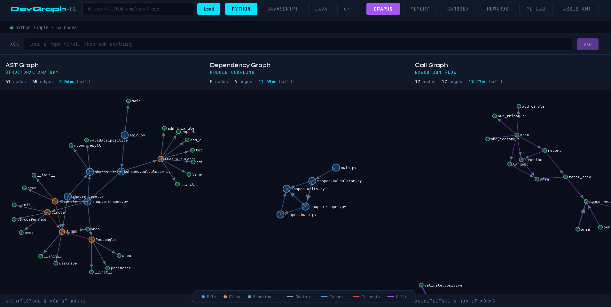
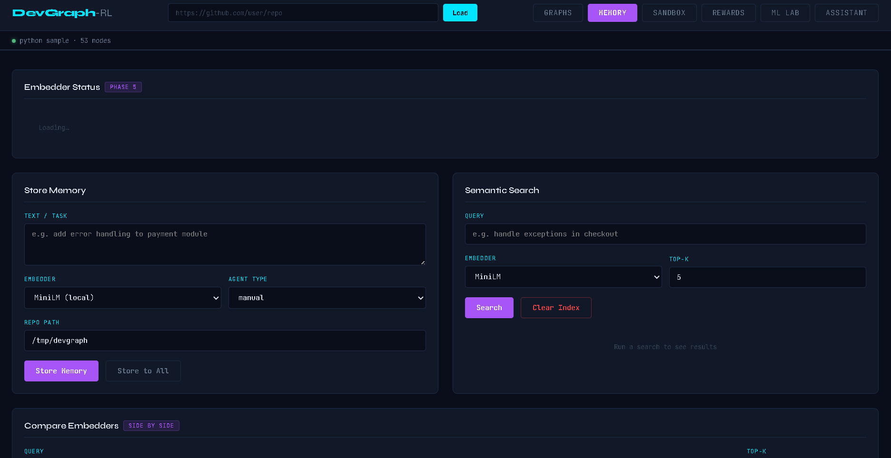
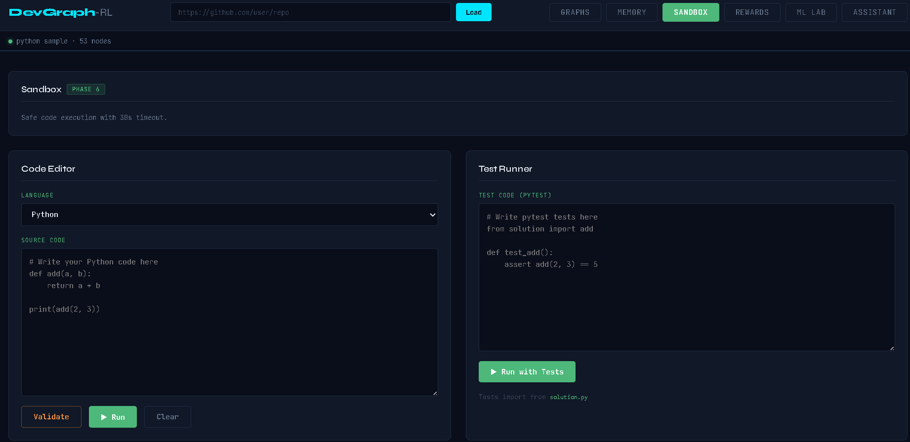
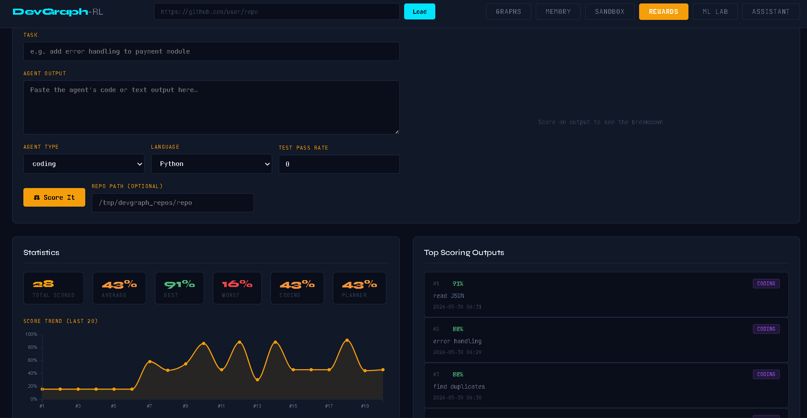
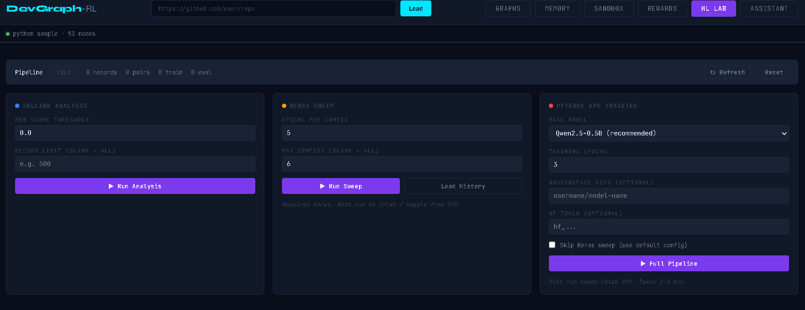
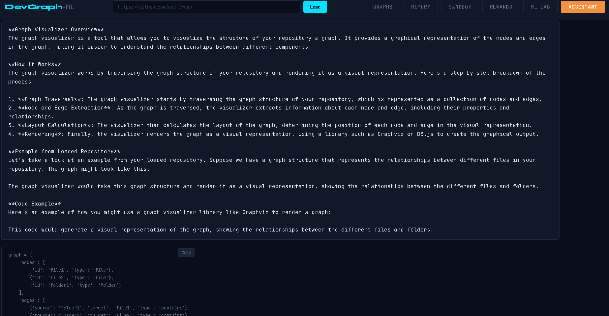

# DevGraph-RL

**Graph-Augmented RLHF Multi-Agent Autonomous Software Engineering System**

[](https://github.com/shubhamtiw17/devgraph-rl/actions/workflows/ci.yml)
[](https://www.python.org/downloads/release/python-3110/)
[](https://fastapi.tiangolo.com)
[](https://pytorch.org)
[](https://console.groq.com)
[](https://aistudio.google.com)
[](https://d3js.org)
[](https://github.com/facebookresearch/faiss)
[](https://scikit-learn.org)
[](https://keras.io)
[](LICENSE)
[](tests/)
[](https://github.com/psf/black)

A production-grade system that combines AST graph intelligence, semantic memory, safe code execution, multi-dimensional reward modelling, and DPO training into a single unified visualiser with a context-aware AI assistant powered by a live LLM router.

---

## Screenshots

### Graphs Tab: AST · Dependency · Call Graph
Interactive D3.js force-directed graphs with zoom, drag, and tooltips. Three simultaneous views of any loaded GitHub repo.



### Memory Tab: Semantic Vector Store
FAISS-backed memory with three parallel embedders (MiniLM local, Gemini, Cohere). Store, search, and compare embedders side by side.



### Sandbox Tab: Safe Code Execution
Security-validated subprocess execution with 30s timeout. Integrated pytest runner — test code imports from `solution.py` automatically.



### Rewards Tab: Multi-Dimensional Scorer
5-dimension reward model with score trend chart and top-N leaderboard. 38 scored outputs shown with 91% best score.



### ML Lab Tab: Full RLHF Pipeline
Three-panel pipeline: sklearn analysis → Keras hyperparameter sweep → PyTorch DPO training. Runs on free Colab T4 GPU.



### Assistant Tab: Context-Aware AI
Live LLM assistant (Groq + Gemini) with auto-detected Generate/Improve/Guide modes. Reads repo state, memory, and reward history as context.



---

## Architecture

```
┌─────────────────────────────────────────────────────────────────┐
│                        FastAPI Visualiser                        │
│  Graphs │ Memory │ Sandbox │ Rewards │ ML Lab │ Assistant        │
└────┬────┴───┬────┴────┬────┴────┬────┴────┬────┴───────┬────────┘
     │        │         │         │         │            │
     ▼        ▼         ▼         ▼         ▼            ▼
  Graph    Memory    Sandbox   Reward    Training    Assistant
  Builder  Manager   Runner    Model     Pipeline    Engine
     │        │         │         │         │            │
     └────────┴─────────┴────────┬┴─────────┘            │
                                 ▼                        │
                           LLM Router ◄───────────────────┘
                         (Groq + Gemini)
```

### Components

| Layer | Module | Description |
|---|---|---|
| **LLM Router** | `src/llm/router.py` | Auto-rotating Groq (llama-3.3-70b) + Gemini (gemini-2.0-flash) with fallback |
| **Agents** | `src/agents/` | Planner, Coding, Reviewer agents built on the router |
| **Graph Intelligence** | `src/graph/` | AST, Dependency, Call graph builders using tree-sitter |
| **Memory** | `src/memory/` | FAISS vector store with 3 embedders (MiniLM, Gemini, Cohere) |
| **Sandbox** | `src/sandbox/` | Safe code execution with validation, subprocess isolation, pytest runner |
| **Reward Model** | `src/rewards/` | 5-dimension scorer (correctness, code quality, task completion, efficiency, security) |
| **Training** | `src/training/` | sklearn analysis → Keras sweep → PyTorch DPO pipeline |
| **Visualiser** | `visualiser/` | FastAPI + D3.js + Chart.js 6-tab interface |
| **Assistant** | `visualiser/services/assistant_engine.py` | Context-aware AI with Generate / Improve / Guide modes |

---

## Features

### Phase 1–3: Foundation
- LLM Router with automatic provider rotation and retry logic
- Multi-agent architecture: Planner decomposes tasks, Coding agent implements, Reviewer scores
- Environment configuration with `.env` and `pyproject.toml` extras

### Phase 4: Graph Intelligence
- **AST Graph** — structural anatomy of any Python/JS/Java/C++ repo
- **Dependency Graph** — module coupling and import chains
- **Call Graph** — execution flow and function relationships
- All three graphs rendered interactively with D3.js force simulation, zoom, drag, tooltips
- Natural language query over loaded repos via `/api/repo/query`

### Phase 5: Memory Layer
- FAISS-backed vector store with configurable index type
- Three embedders running in parallel:
  - **MiniLM** (384-dim, local, no API key required)
  - **Gemini** (768-dim, Google API)
  - **Cohere** (384-dim, Cohere API)
- Side-by-side embedder comparison, cross-index sync, semantic search with top-K retrieval

### Phase 6: Sandbox
- Security validation before any execution (blocks `os.system`, `subprocess`, `eval`, file writes outside `/tmp`, etc.)
- Isolated subprocess execution with 30-second timeout
- Integrated pytest runner, test code imports from `solution.py` automatically
- Supports Python, JavaScript, Java, C++

### Phase 7: Reward Model
- Five scoring dimensions with weighted aggregation:
  - **Correctness** (0.35) : execution success, test pass rate
  - **Code Quality** (0.25) : style, complexity, type hints, docstrings
  - **Task Completion** (0.20) : requirement coverage
  - **Efficiency** (0.10) : algorithmic complexity heuristics
  - **Security** (0.10) : dangerous pattern detection
- Persistent JSONL store with trend tracking, statistics, top-N queries
- Scored outputs feed directly into Phase 8 training pairs

### Phase 8: RLHF Training Pipeline
Three-stage ML pipeline, each with a dedicated visualiser panel:

**Sklearn Analysis**
- Loads reward history from JSONL store
- KMeans clustering into high/medium/low quality buckets
- Feature importance via random forest on scoring dimensions
- Pair selection: identifies (chosen, rejected) pairs with configurable score delta threshold

**Keras Sweep**
- Hyperparameter sweep over learning rate, batch size, hidden dim, dropout
- JAX backend (avoids TensorFlow `.so` issues on Colab/Kaggle)
- Loss curves rendered in-browser via Chart.js
- Best config forwarded automatically to DPO training

**PyTorch DPO Training**
- Direct Preference Optimisation via `trl` + `peft` + LoRA
- Base model: `Qwen/Qwen2.5-0.5B` (fits in free T4 VRAM)
- Optional HuggingFace Hub push after training
- Colab notebook at `notebooks/train_colab.ipynb` for GPU training
- Epoch metrics (loss, chosen reward, rejected reward, delta) streamed to ML Lab tab

**Training result (Colab T4, 4 pairs, 3 epochs):**
```
Epoch 1: reward_delta = +0.047
Epoch 2: reward_delta = +0.180
Epoch 3: reward_delta = +0.438   ← 10x improvement across epochs
```

### Phase 9: Assistant Tab
Context-aware AI assistant embedded in the visualiser.

**Three auto-detected modes** (no manual selection needed):
- **Generate** : writes production-quality code with type hints, docstrings, error handling; validates through sandbox; scores with reward model; auto-stores high-scoring outputs to memory
- **Improve** : scores original code, refactors it, scores again, reports the delta
- **Guide** : explains, debugs, onboards; adapts tone to detected expertise level (beginner/intermediate/expert)

**Context awareness:**
- Reads loaded repo name and language from the repo manager
- Pulls recent semantic memories as context for every LLM call
- Shows reward history statistics in the context bar
- Mode badge (GENERATE/IMPROVE/GUIDE) updates live as you type

---

## Stack

| Layer | Technology |
|---|---|
| Backend | Python 3.11, FastAPI, Uvicorn |
| LLM providers | Groq (llama-3.3-70b-versatile), Google Gemini (gemini-2.0-flash) |
| Graph parsing | tree-sitter (Python, JS, Java, C++) |
| Vector store | FAISS |
| Embedders | sentence-transformers (MiniLM), Google Generative AI, Cohere |
| ML training | scikit-learn, Keras 3 (JAX backend), PyTorch, trl, peft |
| Frontend | Vanilla JS, D3.js v7, Chart.js v4 |
| Testing | pytest, 562 tests |
| CI | GitHub Actions |

---

## Setup

### Prerequisites
- Python 3.11
- WSL2 (Ubuntu) or Linux
- Groq API key : free at [console.groq.com](https://console.groq.com)
- Gemini API key : optional, free at [aistudio.google.com](https://aistudio.google.com)

### Install

```bash
git clone https://github.com/shubhamtiw17/devgraph-rl.git
cd devgraph-rl

python3.11 -m venv .venv
source .venv/bin/activate

pip install -e ".[dev,graphs]"
```

### Configure

```bash
cp .env.example .env
```

Edit `.env`:

```env
GROQ_API_KEY=your_groq_key_here
GEMINI_API_KEY=your_gemini_key_here      # optional
COHERE_API_KEY=your_cohere_key_here      # optional
```

### Run

```bash
uvicorn visualiser.main:app --reload
```

Open [http://localhost:8000](http://localhost:8000)

### Test

```bash
pytest tests/ -v
# 562 passed
```

---

## RLHF Training on Colab (Free GPU)

1. Score at least 5–10 outputs in the **Rewards tab** across different quality levels for the same task
2. Copy `reward_history.jsonl` to Windows:
   ```bash
   cp data/vector_store/reward_history.jsonl /mnt/c/Users/YOUR_USERNAME/Downloads/
   ```
3. Open `notebooks/train_colab.ipynb` in Google Colab with **Runtime → T4 GPU**
4. Run Cell 1 to install deps, then **Runtime → Restart runtime**, then continue from Cell 2
5. Upload `reward_history.jsonl` when Cell 4 prompts
6. Download `training_result.json` from Cell 9
7. Copy to `data/checkpoints/training_result.json` and click **Load History** in the ML Lab tab

**Training time:** 1–3 hours on free T4 depending on dataset size.

---

## Project Structure

```
devgraph-rl/
├── src/
│   ├── llm/                   # LLM router, provider abstractions
│   ├── agents/                # Planner, Coding, Reviewer agents
│   ├── graph/                 # AST, Dependency, Call graph builders
│   ├── memory/                # FAISS store, embedders, memory manager
│   ├── sandbox/               # Code validator and executor
│   ├── rewards/               # Reward model, store, dimensions
│   └── training/              # sklearn, keras, torch training modules
├── visualiser/
│   ├── main.py                # FastAPI app
│   ├── routers/               # graphs, memory, sandbox, rewards, training, assistant
│   ├── services/              # graph_builder, repo_manager, query_engine, assistant_engine
│   └── static/index.html      # Single-file 6-tab visualiser
├── tests/                     # 562 tests
├── notebooks/
│   └── train_colab.ipynb      # GPU training notebook
├── data/
│   ├── vector_store/          # FAISS indexes + reward_history.jsonl
│   └── checkpoints/           # DPO training results
├── docs/images/               # Screenshots
├── pyproject.toml
└── .env
```

---

## API Reference

### Graphs
| Endpoint | Method | Description |
|---|---|---|
| `/api/graphs` | GET | Sample graphs for a language |
| `/api/repo/load` | POST | Clone and parse a GitHub repo |
| `/api/repo/query` | POST | Natural language query over loaded repo |

### Memory
| Endpoint | Method | Description |
|---|---|---|
| `/api/memory/store` | POST | Store text to an embedder index |
| `/api/memory/search` | POST | Semantic search with top-K |
| `/api/memory/search/compare` | POST | Side-by-side embedder comparison |
| `/api/memory/status` | GET | Embedder status and vector counts |
| `/api/memory/sync` | POST | Re-encode from one embedder to all |
| `/api/memory/clear` | DELETE | Clear an embedder index |

### Sandbox
| Endpoint | Method | Description |
|---|---|---|
| `/api/sandbox/validate` | POST | Validate code for dangerous patterns |
| `/api/sandbox/run` | POST | Execute code with optional pytest tests |

### Rewards
| Endpoint | Method | Description |
|---|---|---|
| `/api/rewards/score` | POST | Score an agent output |
| `/api/rewards/stats` | GET | Statistics and score trend |
| `/api/rewards/history` | GET | Recent scored outputs |
| `/api/rewards/top` | GET | Top N outputs by score |
| `/api/rewards/clear` | DELETE | Clear reward history |

### Training
| Endpoint | Method | Description |
|---|---|---|
| `/api/training/analyze` | POST | Run sklearn analysis and pair selection |
| `/api/training/sweep` | POST | Run Keras hyperparameter sweep |
| `/api/training/run` | POST | Run full training pipeline |
| `/api/training/status` | GET | Current pipeline stage and counts |
| `/api/training/history` | GET | Last training result |

### Assistant
| Endpoint | Method | Description |
|---|---|---|
| `/api/assistant/chat` | POST | Send message, get structured response |
| `/api/assistant/reset` | POST | Clear conversation history |
| `/api/assistant/context` | GET | Current system context snapshot |
| `/api/assistant/history` | GET | Conversation history for a session |

---

## CI

GitHub Actions runs on every push:
- Install `.[dev,graphs]` + training deps
- `pytest tests/` : all 562 tests must pass
- No GPU required (torch training uses lazy imports, CI safe)